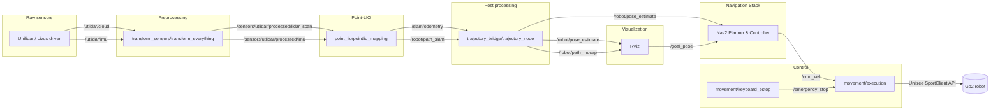

# Point-LIO Go2 — Documentation

## Theoretical Deep Dive

This section provides an in-depth theoretical treatment of the main components: **Point‑LIO** (estimator), **Nav2** (SLAM-only navigation), `transform_sensors` (sensor transforms, biases, timestamp sync), `trajectory_bridge` (mocap ↔ SLAM alignment), and `movement` (command mapping and safety). It collects the core mathematical models and algorithmic choices implemented in the codebase so you can reason about tuning and extension.

### 1. Notation and State Representation
- **Rotation:** We denote rotation from the body frame to the world frame as $R \in SO(3)$. Quaternions are used in code, but the math is described with $R$ and exponential/log maps.
- **Position:** $p \in \mathbb{R}^3$.
- **Velocity:** $v \in \mathbb{R}^3$.
- **IMU Biases:** Gyroscope bias $b_g \in \mathbb{R}^3$, accelerometer bias $b_a \in \mathbb{R}^3$.
- **Gravity Vector:** $g \in \mathbb{R}^3$ (default in code: $[0, 0, -9.81]^T$).
- **Combined Continuous State (Typical LIO):**
  $$x(t) = \{R(t),\ p(t),\ v(t),\ b_g(t),\ b_a(t)\}$$

### 2. IMU Propagation (Continuous and Discrete)
- **Continuous-time model (idealized):**
  $$\dot{p} = v$$
  $$\dot{v} = R(a_m - b_a - n_a) + g$$
  $$\dot{R} = R \, [\omega_m - b_g - n_g]_{\times}$$
  where $a_m, \omega_m$ are measured linear acceleration and angular velocity from the IMU, $n_a, n_g$ are measurement noise, and $[\cdot]_{\times}$ denotes the skew-symmetric matrix of a vector.

- **Discrete propagation over a timestep $\Delta t$ (first-order):**
  $$p_{k+1} = p_k + v_k \Delta t + \frac{1}{2} (R_k (a_m - b_a) + g) \Delta t^2$$
  $$v_{k+1} = v_k + (R_k (a_m - b_a) + g) \Delta t$$
  $$R_{k+1} = R_k \exp([\omega_m - b_g]_{\times} \Delta t)$$
  where $\exp(\cdot)$ is the matrix exponential mapping from $\mathfrak{so}(3)$ to $SO(3)$ (small-angle approximation often used in implementation).

### 3. Measurement Model — LiDAR Point Projection
A LiDAR point in the sensor frame $p_{s}$ is transformed to the body frame and then to the world frame using known extrinsics $T_{bs}$ and the current state $T_{wb} = (R, p)$:
$$p_{w} = R \, (R_{bs} p_s + t_{bs}) + p$$

Given a local planar patch of the map with normal $n$ and plane constant $d$ (plane equation $n^T x + d = 0$), the point‑to‑plane residual is:
$$r = n^T p_w + d$$

The Jacobian of $r$ with respect to the minimal state perturbation (rotation and position) is used in the iterated Kalman update. For a small rotation perturbation $\delta \phi$ (so $R \approx R \exp([\delta\phi]_{\times})$):
$$\frac{\partial r}{\partial \delta \phi} = n^T R (-[p_s^{(b)}]_{\times}), \quad \frac{\partial r}{\partial p} = n^T$$
where $p_s^{(b)}$ is the point position in the body frame prior to the world transform.

### 4. Data Association and ikd‑Tree
The implementation uses an incremental kd‑tree (`ikd‑Tree`) to query the map for the $k = \text{NUM\_MATCH\_POINTS} = 5$ nearest neighbors. For each query point, the code attempts to fit a plane using the matched points via a linear least-squares solve. If the fit residuals for all matched points are below `mapping.plane_thr`, the measurement is accepted.

Given matched points $\{x_i\}_{i=1}^k$, the code solves a linear system of the form $A n' = b$ (with $b = -1$ vector) to recover the normalized plane coefficients. This is a numerically cheap alternative to full PCA when $k$ is small.

### 5. IKFoM: Iterated Kalman Filter on Manifolds
The filter used is an iterated extended Kalman-style filter adapted for manifold states (SO(3) for orientation). Key aspects:
- Use a local chart for rotation (e.g., error rotations in $\mathbb{R}^3$) to maintain Gaussian covariance.
- **Predict Step:** Integrates IMU measurements and propagates covariance using process noise models.
- **Update Step:** Linearizes the point measurement residuals around the current state and applies an iterated correction. Iteration improves convergence for larger nonlinearities originating from rotation.

### 6. Timestamp Handling
Correct state propagation requires aligning IMU timestamps and LiDAR point timestamps. The repository expects **per‑point timestamps** in the `PointCloud2` message. The transformer node computes a one‑off offset:
$$\text{offset} = t_{now} - t_{msg.header.stamp}$$
and then republishes messages with `stamp + offset` to align to the local ROS clock. This is a pragmatic way to handle devices without hardware-synchronized clocks.

### 7. transform_sensors — Calibration Corrections
**Purpose:** Apply extrinsic rotations/translations, correct IMU biases/projection, and filter points prior to feeding the estimator.
- **Rotation Application:** Given a transform `body2cloud` with rotation matrix $R_{bc}$ and translation $t_{bc}$, a sensor point $p_s$ is transformed into the body frame as:
  $$p_b = R_{bc} p_s + t_{bc}$$

- **IMU Bias Correction and Projection:**
  Measured gyro $\omega_m$ is adjusted by sign flips, bias subtraction, and then rotated by a small tilt $\theta = 15.1^\circ$:
  $$x_\omega = \cos\theta \cdot \omega_x - \sin\theta \cdot \omega_z$$
  $$z_\omega = \sin\theta \cdot \omega_x + \cos\theta \cdot \omega_z$$
  Then applied:
  $$x_\omega \leftarrow x_\omega - \text{ang\_bias}_x$$
  $$x_\omega \leftarrow x_\omega + \text{ang\_z2x\_proj} \cdot z_\omega$$
  Linear acceleration is processed similarly (tilt rotation, subtract `acc_bias_*`).

### 8. Nav2: SLAM-Only Navigation & Local Planning
Because this system maps dynamically without a pre-saved static map, the Nav2 stack is heavily modified to operate in a "blind" rolling-window mode with strictly constrained kinematics.

- **Dynamic Rolling Costmaps:** The global costmap does not represent a fixed room. It is a $40\times40$ meter `rolling_window` centered on `body_center`. As the robot moves through the `camera_init` (world) frame, the map translates with it, forgetting old data and capturing new LiDAR hits. The `inflation_layer` expands these 2D hits into danger gradients via exponential decay $C = \exp(-\text{cost\_scaling\_factor} \times \text{distance})$.
- **Strict Non-Holonomic Kinematics:** The robot is mathematically forced to drive like a car. By setting `min_vel_x: 0.0` and `max_vel_y: 0.0`, the `DWBLocalPlanner` is explicitly forbidden from generating trajectories that involve strafing or reversing.
- **DWB Critic Lobotomy (Solving Empty-Room Oscillation):** Standard Nav2 utilizes orientation critics (`GoalAlign`, `PathAlign`) to ensure the robot points directly along the planned line. However, because the robot cannot strafe to correct minor lateral drift, these alignment critics fight the distance critics (`GoalDist`, `PathDist`). To prevent the robot from violently oscillating its yaw in open space, the alignment critics are removed. The robot navigates purely by minimizing $X,Y$ planar distance to the goal while maximizing distance from obstacles (`BaseObstacle`).
- **Recovery Hierarchy (`behavior_server`):** If the `DWBLocalPlanner` evaluates its simulated trajectories and finds $0$ safe paths, it aborts. Control is handed to the `behavior_server`, which sequentially attempts a 90-degree `spin` (to clear the rolling costmap with fresh LiDAR data), a 5-second `wait`, and a blind `backup` maneuver.

### 9. trajectory_bridge — Alignment and Logging
**Purpose:** Publish the SLAM path, optionally read OptiTrack mocap frames, align the mocap to the SLAM frame, and log both.
- **Odometry Translation:** The bridge subscribes to `/slam/odometry` (which centers on the LiDAR) and applies the physical offset to broadcast a new odometry frame explicitly centered on `body_center`. This ensures the Nav2 controller simulates movement from the robot's physical hips, not its sensor head.
- **Alignment Approach:**
  1. Wait for SLAM to produce a stable reference pose. Capture the SLAM pose $p_{slam}^0, R_{slam}^0$.
  2. Capture the initial mocap pose $p_{mocap}^0, R_{mocap}^0$.
  3. Align subsequent mocap observations:
     $$p_{mocap,zeroed} = R_{mocap}^0{}^{-1} (p_{mocap} - p_{mocap}^0)$$
     $$p_{mocap,aligned} = R_{slam}^0 \, p_{mocap,zeroed} + p_{slam}^0$$
- **Logging:** Trajectories are written to `~/ros2_ws/slam_trajectory.txt` and `mocap_trajectory.txt`.

### 10. movement — Control Mapping and Safety
- **Input:** `geometry_msgs/Twist` on `/cmd_vel` (linear.x, linear.y, angular.z).
- **Mapping & Safety Rules:**
  - $v_x$ is clamped to $[-0.3, 0.3]$ m/s.
  - $v_y$ is forced to $0.0$ m/s (strictly forward/turn kinematics).
  - $\omega_z$ is clamped to $[-0.5, 0.5]$ rad/s.
  - Commands are forwarded to `SportClient.Move(vx, vy, yaw_rate)` at a smooth rate of 20 Hz (0.05 s interval).
  - **Watchdog:** Stops motion if no command arrives for 0.5 s.

---

## Topic Dataflow Map



---

## Quick Summary
A lightweight ROS 2 workspace combining a port of Point‑LIO (C++), sensor transformation helpers, mocap ↔ SLAM bridging, and movement utilities tailored for autonomous navigation of the Unitree Go2 via Unilidar (L1/L2).

## Architecture & Modules
- **`point_lio`** — C++ SLAM/LIO. KD/geometry helpers in `point_lio/include/` (ikd‑Tree, `common_lib.h`).
- **`transform_sensors`** — Python node `transform_everything.py`. Applies extrinsics, IMU bias correction, timestamp alignment, and point‑cloud box filtering.
- **`trajectory_bridge`** — Python nodes `trajectory_node.py` / `offline_trajectory_node.py`. Aligns SLAM odometry with OptiTrack mocap and broadcasts translated odometry to Nav2.
- **`movement`** — Runtime helpers. `execution.py` (Nav2 → Unitree SportClient), `keyboard_estop.py` (terminal E‑STOP).

---

## Explicit Calibration & Defaults

### Numeric Quaternions
Computed from Euler `xyz` as used in `transform_everything.py`:
- **`body2cloud`** Euler `xyz = [0, 2.8782025850555556, 0]` rad
  - Quaternion $(x, y, z, w) \approx (0.0, 0.991355, 0.0, 0.131859)$
- **`body2imu`** Euler `xyz = [0, 2.8782025850555556, \pi]` rad
  - Quaternion $(x, y, z, w) \approx (-0.991355, 0.0, 0.131859, 0.0)$

### IMU Biases and Projection Corrections
Defaults used when `~/Desktop/imu_calib_data.yaml` is not found:
- **Accelerometer biases (m/s²):** `x = -0.824918`, `y = 1.82014`, `z = -0.278397`
- **Gyroscope biases (rad/s):** `x = -0.00289323`, `y = 0.000271719`, `z = -0.000959372`
- **Angular projection corrections:** `ang_z2x = 0.135082`, `ang_z2y = -0.192149`

### Point Filter Box
Points inside this bounding box are removed prior to republishing to prevent self-collision noise (phantom obstacles):
- `cam_offset = 0.046825` m
- $x \in [-0.7, -0.1]$ m
- $y \in [-0.3, 0.3]$ m
- $z \in [-0.646825, -0.046825]$ m

### Estimator Defaults (`parameters.cpp`)
- **Thresholds:**
  - `mapping.satu_acc = 3.0` | `mapping.satu_gyro = 35.0`
  - `mapping.plane_thr = 0.05` m
  - `mapping.imu_time_inte = 0.005` s
- **Covariances:**
  - `mapping.acc_cov_input = 0.1` | `mapping.gyr_cov_input = 0.1`
  - `mapping.b_gyr_cov = 0.0001` | `mapping.b_acc_cov = 0.0001`

---

## Build & Run

**Local Build (Ubuntu 22.04 + ROS 2 Humble):**
```bash
sudo apt update && sudo apt install -y build-essential cmake libeigen3-dev \
  ros-humble-pcl-ros ros-humble-pcl-conversions ros-humble-visualization-msgs \
  ros-humble-navigation2 ros-humble-nav2-bringup python3-pip

mkdir -p ~/ros2_ws/src
cd ~/ros2_ws/src
git clone [https://github.com/aron-assani/point_lio_go2.git](https://github.com/aron-assani/point_lio_go2.git)
cd ~/ros2_ws
colcon build --symlink-install
source install/setup.bash
```

**Example Launches:**
```bash
export NETWORK_INTERFACE=eno2
ros2 launch point_lio mapping_utlidar.launch enable_navigation:=true use_sim_time:=false
ros2 run movement keyboard_estop
```

---

## Developer Pointers
- **Kalman Internals & Jacobians:** `point_lio/src/Estimator.cpp`
- **Plane-fitting & KD Logic:** `point_lio/include/common_lib.h` and `point_lio/include/ikd-Tree/`
- **Movement Runtime:** `movement/movement/execution.py`
- **Transformer Code:** `transform_sensors/transform_sensors/transform_everything.py`

**References:**
- Point‑LIO Paper & Repo: [GitHub](https://github.com/hku-mars/Point-LIO) | [Wiley](https://onlinelibrary.wiley.com/doi/epdf/10.1002/aisy.202200459)
- IKFoM: [GitHub](https://github.com/hku-mars/IKFoM)