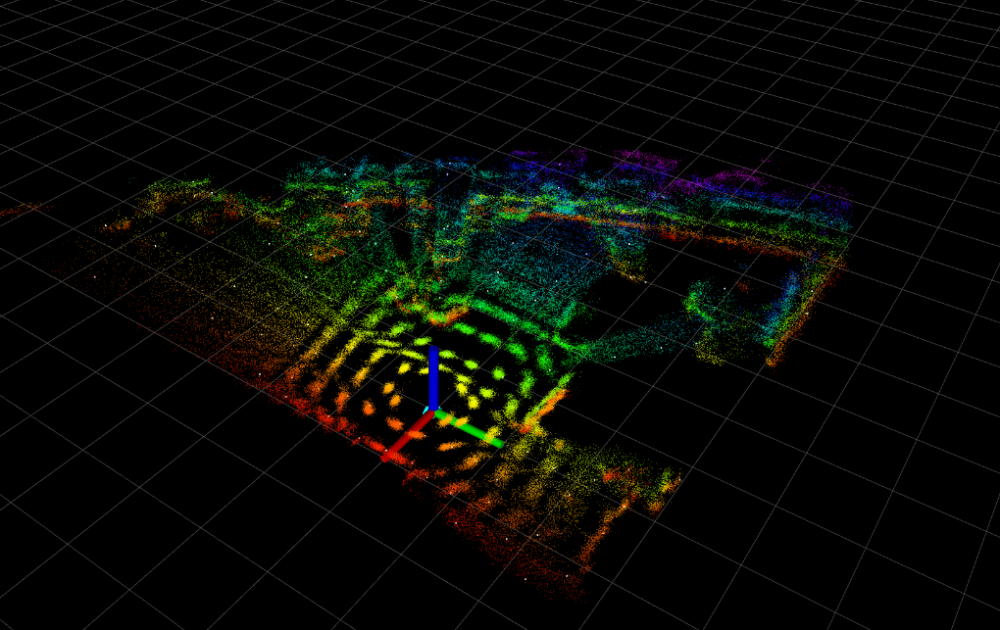
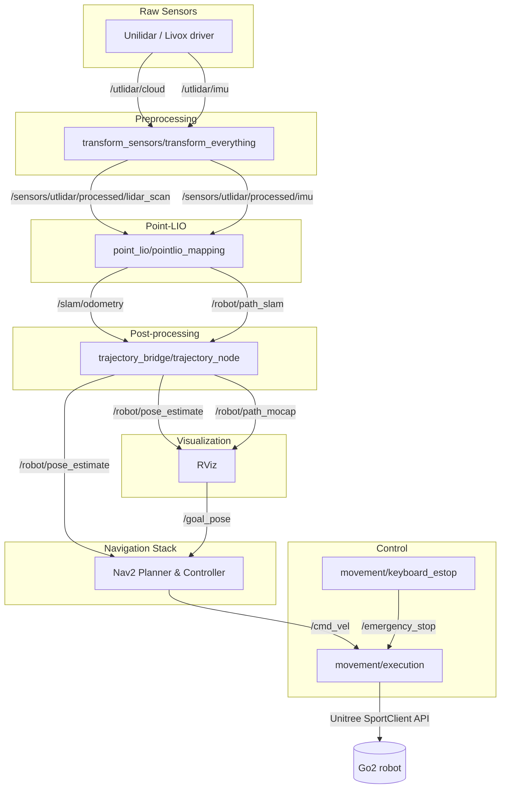
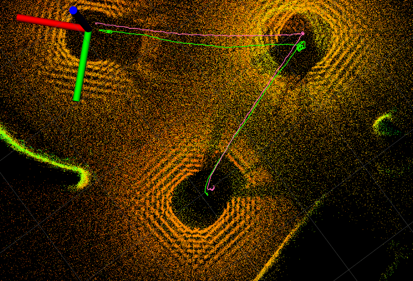
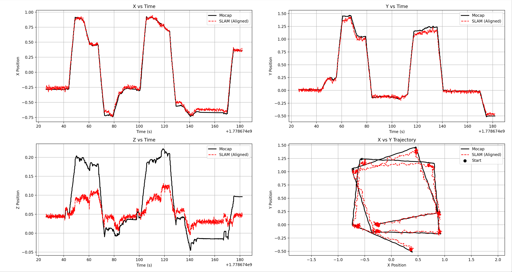

# Point-LIO Go2

<div align="center">
  
  <br>
</div>

A ROS 2 workspace integrating LiDAR-inertial mapping, autonomous navigation, and helper packages tailored for the Unitree Go2 robot equipped with a Unilidar sensor. 

This repository heavily adapts the original Point-LIO algorithm and integrates it with a Nav2 stack operating in a rolling-window costmap mode, bypassing the need for static map saving/loading.

## Overview of Packages
- **`point_lio`**: C++ SLAM/LIO module based on Iterated Kalman Filters on Manifolds (IKFoM) and incremental kd-trees.
- **`transform_sensors`**: Python node for external calibration transformations, IMU bias correction, time-synchronization, and pointcloud filtering (self-collision box).
- **`trajectory_bridge`**: Python utilities to bridge SLAM odometry with OptiTrack motion capture systems for ground-truth alignment and evaluation.
- **`movement`**: Runtime execution scripts translating Nav2 velocity commands into Unitree SportClient API instructions, alongside a terminal-based E-STOP.
- **`unitree_sdk2_python`**: Official Unitree robot SDK.

### Modifications to Original Point-LIO
- Reparameterized the YAML configurations for improved stability.
- Created a custom RViz configuration for better visualization.
- Rewritten launch files to instantiate only the necessary nodes.
- Switched to using the Go2-specific `utlidar/` topic instead of the default `unilidar/` topic.

---

## System Architecture



---

## Installation & Build

The entire pipeline runs inside a containerized Docker environment. The container requires host network access to communicate with the LiDAR and robot hardware.

**1. Build the Docker Image**
```bash
# Allow Docker to connect to the host's X11 server for RViz
xhost +local:docker 

docker compose build \
  --build-arg NETWORK_INTERFACE=enx00133b9a06ef \
  --no-cache
```
*Note: Adjust the `NETWORK_INTERFACE` to match your hardware (e.g., USB-Ethernet adapter).*

**2. Start the Workspace**
```bash
docker compose up -d
docker exec -it point_lio_go2 /bin/bash
```

---

## Usage

You can dynamically override the network interface at runtime by prefixing `NETWORK_INTERFACE=<interface>` to your launch commands. 

### Mapping & Navigation Modes

**Online Mode (With OptiTrack Mocap):**
*Runs SLAM, Nav2, and aligns the Mocap trajectory for evaluation.*
```bash
NETWORK_INTERFACE=enx00133b9a06ef ros2 launch point_lio mapping_utlidar.launch enable_navigation:=true enable_optitrack:=true
```

**Online Mode (No Mocap):**
*Standard autonomous navigation.*
```bash
NETWORK_INTERFACE=enx00133b9a06ef ros2 launch point_lio mapping_utlidar.launch enable_navigation:=true enable_optitrack:=false use_sim_time:=false
```

**Offline Mode (Rosbag Replay):**
*Processes pre-recorded rosbags using simulated time.*
```bash
NETWORK_INTERFACE=offline ros2 launch point_lio mapping_utlidar.launch enable_navigation:=true use_sim_time:=true
```

### Controlling the Robot

**Sending a Goal Pose:**
To send the robot to a target 1 meter ahead of the `camera_init` frame via Nav2:
```bash
ros2 topic pub --once /goal_pose geometry_msgs/msg/PoseStamped "{
  header: {frame_id: 'camera_init'}, 
  pose: {
    position: {x: 1.0, y: 0.0, z: 0.0}, 
    orientation: {x: 0.0, y: 0.0, z: 0.0, w: 1.0}
  }
}"
```

**Emergency Stop (E-STOP):**
In a new terminal attached to the container, run the keyboard estop. Press `p` to immediately halt movement.
```bash
ros2 run movement keyboard_estop
```

---

## Results & Visualization

### SLAM Odometry vs Mocap Ground Truth
<div align="center">
  
  <br>
</div>
<div align="center">
  
  <br>
</div>

---

## References
- **Point-LIO**: [GitHub](https://github.com/hku-mars/Point-LIO) | [Paper (Wiley)](https://advanced.onlinelibrary.wiley.com/doi/epdf/10.1002/aisy.202200459)
- **IKFoM**: [GitHub](https://github.com/hku-mars/IKFoM)
- **Nav2**: [GitHub](https://github.com/ros-navigation/navigation2)
- **Point-LIO ROS2 Port**: [dfloreaa/point_lio_ros2](https://github.com/dfloreaa/point_lio_ros2)
- **Autonomy Stack Go2 (transform_sensors)**: [jizhang-cmu/autonomy_stack_go2](https://github.com/jizhang-cmu/autonomy_stack_go2)