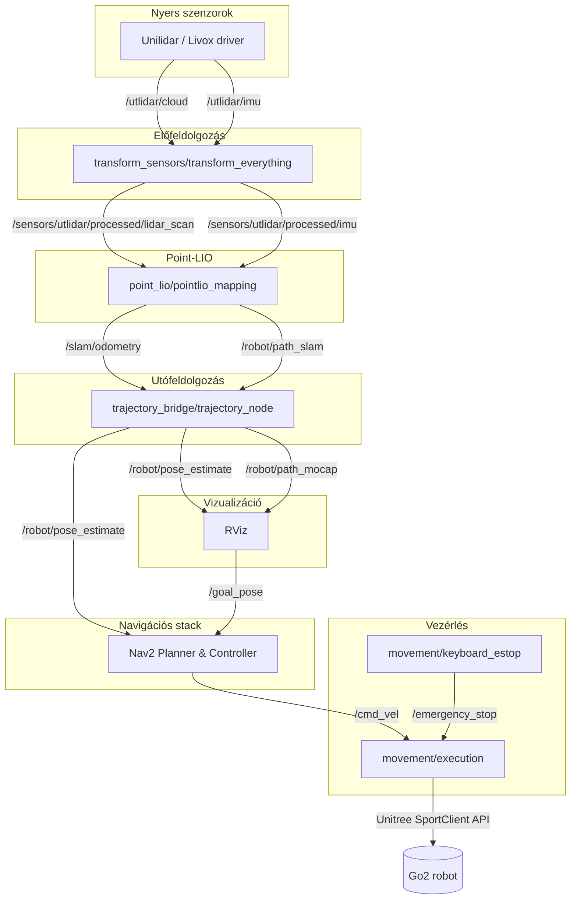

# Point-LIO Go2

## Háttér

**Point‑LIO**, **Nav2**, `transform_sensors`, `trajectory_bridge` és `movement` működési elvének rövid összefoglalója.

### 1. Jelölések,  állapotvektor
- **Orientáció:** A testkoordináta-rendszerből (body frame) a világkoordináta-rendszerbe (world frame) forgatás: $R \in SO(3)$. A kód kvaterniókat, az elméleti leírás pedig $R$ mátrixot, exponenciális és logaritmikus leképezéseket haszál.
- **Pozíció:** $p \in \mathbb{R}^3$.
- **Sebesség:** $v \in \mathbb{R}^3$.
- **IMU torzítások (biases):** Giroszkóp torzítás $b_g \in \mathbb{R}^3$, gyorsulásmérő torzítás $b_a \in \mathbb{R}^3$.
- **Gravitációs vektor:** $g \in \mathbb{R}^3$ (alapértelmezett érték a kódban: $[0, 0, -9.81]^T$).
- **Folytonos idejű állapotvektor:**
  $$x(t) = \{R(t),\ p(t),\ v(t),\ b_g(t),\ b_a(t)\}$$

### 2. IMU állapotpropagáció (folytonos és diszkrét)
- **Folytonos idejű modell:**
  $$\dot{p} = v$$
  $$\dot{v} = R(a_m - b_a - n_a) + g$$
  $$\dot{R} = R \, [\omega_m - b_g - n_g]_{\times}$$
  $a_m, \omega_m$ az IMU által mért lineáris gyorsulást és szögsebességet, $n_a, n_g$ a mérési zajokat, a $[\cdot]_{\times}$ pedig egy vektor antiszimmetrikus mátrixát jelöli.

- **Diszkrét állapot-előrejelzés $\Delta t$ időlépésenként:**
  $$p_{k+1} = p_k + v_k \Delta t + \frac{1}{2} (R_k (a_m - b_a) + g) \Delta t^2$$
  $$v_{k+1} = v_k + (R_k (a_m - b_a) + g) \Delta t$$
  $$R_{k+1} = R_k \exp([\omega_m - b_g]_{\times} \Delta t)$$
  $\exp(\cdot)$ a mátrixexponenciális leképezés az $\mathfrak{so}(3)$ Lie-algebráról az $SO(3)$ csoportra (a kódban asszimptotikus közelítéssel implementálva).

  $$R = \exp([\boldsymbol{\theta}]_\times) = I + \sin(\|\boldsymbol{\theta}\|) K + (1 - \cos(\|\boldsymbol{\theta}\|)) K^2, \quad \text{ahol} \quad K = \frac{[\boldsymbol{\theta}]_\times}{\|\boldsymbol{\theta}\|}$$

  Mivel az IMU magas frekvenciájú mérései között az elfordulás szöge elhanyagolható ($\|\boldsymbol{\theta}\| \to 0$), a program a nullával való osztás elkerülése és a numerikus stabilitás miatt aszimptotikus közelítést alkalmaz: a logaritmikus visszaképezésnél elsőrendű Taylor-sorba fejtéssel ($\frac{\theta}{\sin\theta} \approx 1$), az exponenciális leképezésnél pedig $\|\boldsymbol{\theta}\| < 10^{-7}$ küszöbérték alatt az egységmátrixszal ($R \approx I$) számol.

### 3. LiDAR pontvetítés
A szenzor koordináta-rendszerében mért $p_{s}$ LiDAR pont először az ismert $T_{bs} = (R_{bs}, t_{bs})$ külső kalibrációs paraméterek segítségével áttranszformálódik a robot testkoordináta-rendszerébe:
$$p_s^{(b)} = R_{bs} p_s + t_{bs}$$

Ezt követően a pont az aktuális $T_{wb} = (R, p)$ állapotbecslés alapján kerül át a világkoordináta-rendszerbe:
$$p_{w} = R \, p_s^{(b)} + p$$

Adott a térkép egy lokális síkfelülete, amelynek normálvektora $n$, síkállandója $d$ (a sík egyenlete $n^T x + d = 0$). Ekkor a pont-sík távolsági (reziduális) hiba:
$$r = n^T p_w + d$$

Az iterált Kálmán-szűrős (IKF) frissítéshez az $r$ állapotperturbációkra (orientáció és pozíció) vonatkozó Jacobi-mátrixai vannak felhasználva. Egy kis $\delta\phi$ testkoordináta-rendszerbeli orientációs hiba esetén a perturbált forgást az $\tilde{R} = R \exp([\delta\phi]_{\times}) \approx R(I + [\delta\phi]_{\times})$ képlet írja le. Az antiszimmetrikus szorzás tulajdonságát ($[a]_\times b = -[b]_\times a$) kihasználva a reziduális hiba analitikus Jacobi-mátrixának nem nulla elemei:
$$\frac{\partial r}{\partial \delta \phi} = -n^T R [p_s^{(b)}]_{\times}, \quad \frac{\partial r}{\partial p} = n^T$$

### 4. Adathozzarendelés és inkrementális kd-fa (ikd-Tree)
Az implementáció egy inkrementális kd-fát (`ikd-Tree`) használ a térkép lekérdezésére, hogy megkeresse a $k = \text{NUM\_MATCH\_POINTS} = 5$ legközelebbi szomszédot. A kód minden egyes vizsgált ponthoz megkísérel illeszteni egy síkot az illesztett pontok alapján, a lineáris legkisebb négyzetek módszerével. Ha az illesztési hiba minden elemre kisebb, mint a `mapping.plane_thr`, a rendszer érvényes mérésként elfogadja.

Az $\{x_i\}_{i=1}^k$ illesztett pontok alapján az algoritmus egy $A n' = b$ alakú lineáris egyenletrendszert old meg (ahol a $b = -1$ vektor), hogy visszanyerje a normált síkegyütthatókat. Kis $k$ érték esetén hatékony.

### 5. IKFoM: Iterated Kalman Filter on Manifolds
A rendszer egy nem-euklideszi sokaságokra (manifolds) általánosított iterált kiterjesztett Kálmán-szűrőt (IEKF) alkalmaz, amely kiküszöböli a 3D-s forgások ($SO(3)$) lineáris kezeléséből eredő topológiai torzulásokat.

- **Lie-csoportos paraméterezés ($\boxplus$ / $\boxminus$ operátorok):** A forgásmátrixok ortogonalitásának megőrzése érdekében az állapotot és az érintőteret az alábbi operátorok kötik össze:
  - $\boxplus$: $\delta x \in \mathbb{R}^3$ mellett $x \boxplus \delta x = x \exp([\delta x]_\times) \in SO(3)$
  - $\boxminus$: $x_1, x_2 \in SO(3)$ mellett $x_2 \boxminus x_1 = \log\left(x_1^{-1} x_2\right)^\vee = \log\left(x_1^T x_2\right)^\vee \in \mathbb{R}^3$
- **Propagáció:** Az IMU-méréseket vezérlőbemenetként integrálja a sokaságon, miközben a kovarianciát a hibaállapot ($F_x$) és a folyamatzaj ($F_w$) Jacobi-mátrixaival propagálja: $P_{k+1|k} = F_x P_{k|k-1} F_x^T + F_w Q F_w^T$.
- **Iterált korrekció:** A LiDAR-mérések (10–20 Hz) feldolgozásakor egy belső hurokban addig számolja újra a pont-sík reziduális hiba $H$ Jacobi-mátrixát a folyamatosan frissülő állapotbecslés körül, amíg a módosítás a konvergencia-küszöb alá nem csökken ($\|\Delta x_j\| < \varepsilon$). Ez hivatott megelőzni a szűrő szétesését gyors, nemlineáris forgásoknál.

### 6. Időbélyegek kezelése és szinkronizáció
A pontos állapotpropagációhoz az IMU és a LiDAR mérések időbélyegei szinkronizálva vannak. A `PointCloud2` üzenetnek pontokhoz rendelt egyedi időbélyegeket (per-point timestamps) kell tartalmaznia. A transzformációs node kiszámít egy egyszeri időeltolódást:
$$\text{offset} = t_{now} - t_{msg.header.stamp}$$
majd a beérkező üzeneteket `stamp + offset` időbélyeggel továbbítja (republish), és a lokális ROS rendszerórával szinkronizálja.

### 7. transform_sensors — kalibrációs korrekciók és pontszűrés
- **Pontfelhő transzformáció:**
  A szenzor koordináta-rendszerében mért $p_s$ pontokat a `body2cloud` rotációs mátrix ($R_{bc}$) és transzlációs vektor ($t_{bc}$) átalakítja a robot testkoordináta-rendszerébe, majd a Z-tengelyen korrigálja a kamera/szenzor magassági eltolásával (`cam_offset` $= 0.046825\text{ m}$): (ennek most épp sok értelmét nem látom)
  $$p_b = R_{bc} \, p_s + t_{bc} - \begin{bmatrix} 0 \\ 0 \\ \text{cam\_offset} \end{bmatrix}$$
  A transzformáció után egy 3D-s befoglaló téglatest (`is_in_filter_box`) segítségével az algoritmus eldobja a robot saját körvonalán belül eső pontokat.

- **IMU előjelváltás, dőléskompenzáció:**
  A bal- és jobbkezes koordináta-rendszeri eltérés miatt a nyers szögsebesség ($\omega_m$) és lineáris gyorsulás ($a_m$) méréseken az Y és Z tengelyeken előjel-inverzió van végrehajtva:
  $$\omega_x \leftarrow \omega_x, \quad \omega_y \leftarrow -\omega_y, \quad \omega_z \leftarrow -\omega_z$$
  $$(a_x \leftarrow a_x, \quad a_y \leftarrow -a_y, \quad a_z \leftarrow -a_z)$$
  Ezt követően a szenzor $\theta = 15.1^\circ$-os dőlését mindkét méréstípusra egy Y-tengely körüli forgatással van kompenzálva:
  $$x' = \cos\theta \cdot x - \sin\theta \cdot z$$
  $$y' = y$$
  $$z' = \sin\theta \cdot x + \cos\theta \cdot z$$

- **Torzítások (bias és projection) korrekciója:**
  A forgatás után `bias` kivonása. A szögsebesség esetén a tengelyek közötti keresztirányú torzulás is korrigálása a Z-tengely arányában. A lineáris gyorsulásra ez a vetítési korrekció nem vonatkozik:
  $$\omega_{\text{korr}} = \begin{bmatrix} \omega'_x - \text{ang\_bias}_x + \text{ang\_z2x\_proj} \cdot (\omega'_z - \text{ang\_bias}_z) \\ \omega'_y - \text{ang\_bias}_y + \text{ang\_z2y\_proj} \cdot (\omega'_z - \text{ang\_bias}_z) \\ \omega'_z - \text{ang\_bias}_z \end{bmatrix}$$
  $$a_{\text{korr}} = \begin{bmatrix} a'_x - \text{acc\_bias}_x \\ a'_y - \text{acc\_bias}_y \\ a'_z - \text{acc\_bias}_z \end{bmatrix}$$

### 8. Nav2: Kizárólag SLAM-alapú navigáció és lokális útvonaltervezés
Mivel a rendszer előre mentett statikus térkép nélkül dolgozik, a Nav2 stack dinamikus, gördülőablakos módon és egyszerűsített kinematikával működik.

**Egyedi útvonaltervezés nehézsége:** Egy natív szkript (pl. A* + Pure Pursuit) valós 3D LiDAR-os környezetben történő futtatásához az alábbi további infrastruktúra kell:

  - **Aszinkron szálkezelés:** A CPU-igényes globális A* útvonalkeresés (1–2 Hz) nem blokkolhatja a motorokat vezérlő, gyors lokális hurkot (20 Hz).
  - **Valós idejű poligon-ütközésvizsgálat:** A pontos footprint metszetszámítását a térképpel optimalizált alacsony szintű kód nélkül túlterheli a processzort.
  - **3D sugárkövetés (Raycasting):** A `VoxelLayer` 20 Hz-es térbeli törlése nélkül a mozgó dinamikus tárgyak nyomai a rácson maradnak, 'fantomfalakat' hagy.
  - **Aszinkron TF-sodródás korrekciója:** A folyamatosan ugráló SLAM-pozícióbecslés miatt időszinkronizált pufferezésre és geometriai extrapolációra van szükség, különben a vezérlő 20–50 ms-mal korábbi, múltbeli koordináták alapján küld motorparancsot.
  - **Reaktív hibaelhárítás (Deadlock):** Az `if/else` logika a hibánál végleg leáll. A Nav2 viselkedésfát (`bt_navigator`) használ, determinisztikus állapotokkal indítja a hibakezeléseket (helyben forgás, vak tolatás).

**Kettős gördülő costmap:** Statikus térkép hiányában mindkét réteg a robot (`body_center`) körül mozgó `rolling_window: true` módban, más frekvencával működik:
  - *Globális cosmap ($40\times40\text{ m}$, 1–2 Hz):* Rövid távú térbeli memória. A nagy méret a zsákutcák elkerülése miatt kell.
  - *Lokális costmap ($3\times3\text{ m}$, 20 Hz):* Ütközéselkerülésért felel. A közvetlen környezetet dolgozza fel, hogy a dinamikusan belépő akadályokra reagáljon.
  - *Veszélyességi gradiens:* Az `inflation_layer` az akadályok köré exponenciális lecsengést számol: $C = \exp(-\text{cost\_scaling\_factor} \times \text{distance})$.

**Kiértékelő egyszerűsítése:** A robot oldalazása és tolatása tiltott. Mivel a mozgáskorlátok miatt az orientációs kiértékelők (`GoalAlign`, `PathAlign`) folyamatosan harcolnának a távolsági kiértékelőkkel, ezért nincsenek használva. A DWB (Dynamic Window Approach) vezérlő trajektóriáit egy egyszerűsített costmap értékeli ki:
  $$C_{\text{total}} = w_{\text{path}} \cdot \text{PathDist} + w_{\text{goal}} \cdot \text{GoalDist} + w_{\text{obs}} \cdot \text{ObstacleCost}$$

**Helyreállító lánc (Recovery):** Ha a DWB nem talál érvényes utat a lokális térképen, a vezérlés a `behavior_server`-re száll: 90°-os forgás (`spin` a térképfrissítéshez) $\rightarrow$ 5 s várakozás $\rightarrow$ vak tolatás (`backup`), végül a globális útvonal újratervezése.

### 9. Illesztés
A SLAM trajektória publikálása, opcionálisan az OptiTrack mocap adatok beolvasása és publikálása, a mocap adatok illesztése a SLAM koordináta-rendszerbe, mindkettő naplózása.
- **Odometria eltolása:** A bridge feliratkozik a `/slam/odometry` topic-ra (ennek középpontja a LiDAR szenzor), és alkalmazza a fizikai eltolást, hogy egy új, a robot középpontjára (`body_center`) vetített odometria-koordinátarendszert használjon.
- **Illesztési mód:**
  1. Megvárja, amíg a SLAM egy stabil referencia-pozíciót ad, és rögzíti a kezdeti SLAM állapotot: $p_{slam}^0, R_{slam}^0$.
  2. Rögzíti a kezdeti mocap állapotot: $p_{mocap}^0, R_{mocap}^0$.
  3. Illeszti a soron következő mocap méréseket:
     $$p_{mocap,zeroed} = R_{mocap}^0{}^{-1} (p_{mocap} - p_{mocap}^0)$$
     $$p_{mocap,aligned} = R_{slam}^0 \, p_{mocap,zeroed} + p_{slam}^0$$
- **Naplózás:** A trajektóriákat a rendszer a `~/ros2_ws/slam_trajectory.txt` és `mocap_trajectory.txt` fájlokba írja.

### 10. Mozgásvezérlés
- **Bemenet:** `geometry_msgs/Twist` üzenetek a `/cmd_vel` topic-on (linear.x, linear.y, angular.z).
- **Szabályok:**
  - A $v_x$ sebesség $[-0.3, 0.3]$ m/s tartományra vágva (clamping).
  - A $v_y$ sebesség $0.0$ m/s (előrehaladási és fordulási kinematika).
  - Az $\omega_z$ szögsebesség $[-0.5, 0.5]$ rad/s tartományra vágva.
  - A vezérlőparancsokat a rendszer a `SportClient.Move(vx, vy, yaw_rate)` függvényen keresztül továbbítja 20 Hz-en.
  - Watchdog: leállítja a mozgást, ha 0,5 másodpercen belül nem érkezik új vezérlési parancs.

### 11. Korlátok
- **Alapvető modulok hiánya:** A Point-LIO köré a nulláról kell felépíteni az alábbiakat:
  - Pontonkénti időbélyegek (per-point timestamps) 
  - Szenzorkalibráció és előjelváltás
  - Vizualizációs eszköz
  - Navigációs stack
  - Nincs statikus térkép (`.pcd` mentés és betöltés), helyette gördülőablakos lokális költségtérkép
  - Kommunikációs csatornák és ahhoz egy protokoll kialakítása
- **SLAM-stabilitásvesztés a vezérlési hurokban:** Az IKFoM könnyen elveszíti a konvergenciát a zárt láncú navigáció során. Amikor a Nav2 lokális tervezője (DWB) nem talál érvényes utat és elkezd hibaelhárítani, a SLAM odometria nem tudja lekövetni.
- **A Nav2 paraméterezése:** Ez egy kiterjesztett navigációs rendszer, ahhoz, hogy a kutyára lehessen szabni, el kéne mélyedni a működésében/felépítésében.
- **Kezdeti feltételek:** Minden indításnál új térkép keletkezik, így alapértelmetett pózból kell indítani a térképezést.

---



---

## Működés
ROS 2 munkaterület (workspace), a Point‑LIO (C++) portját, a szenzortranszformációs segédkódokat, a mocap ↔ SLAM áthidalót és a mozgásvezérlési modulokat hangolja össze. Unitree Go2 robot autonóm navigációs célzattal, Unilidar (L1/L2) szenzor használatával.

## Rendszerarchitektúra és modulok
- **`point_lio`** — C++ SLAM/LIO modul. Segédkönyvtárakat a `point_lio/include/` tartalmazza (ikd‑Tree, `common_lib.h`).
- **`transform_sensors`** — Python node (`transform_everything.py`). Külső kalibrációs transzformációk, IMU torzítások javítása, időbélyeg-szinkronizáció és a pontfelhő szűrése.
- **`trajectory_bridge`** — Python node-ok (`trajectory_node.py` / `offline_trajectory_node.py`). SLAM odometria összehangolása az OptiTrack mocap rendszerrel, és a robot geometriai középpontjára átalakított odometria-adatok továbbítása a Nav2 és az RViz felé.
- **`movement`** — Futásidőben működő segédmodulok. Az `execution.py` ( Nav2 parancsokat fordít le Unitree SportClient utasításokra), és a `keyboard_estop.py` (terminálalapú E‑STOP) node-okat tartalmazza.

---

## Kalibrációs adatok

### Kvaterniók
A `transform_everything.py` fájlban használt Euler `xyz` szögekből:
- **`body2cloud`** Euler `xyz = [0, 2.8782025850555556, 0]` rad
  - Kvaternió $(x, y, z, w) \approx (0.0, 0.991355, 0.0, 0.131859)$
- **`body2imu`** Euler `xyz = [0, 2.8782025850555556, pi]` rad
  - Kvaternió $(x, y, z, w) \approx (-0.991355, 0.0, 0.131859, 0.0)$

### IMU torzítások (biases) és vetítési korrekciók
Alapértelmezett értékek, ha a `~/Desktop/imu_calib_data.yaml` fájl nem található:
- **Gyorsulásmérő torzítások (m/s²):** `x = -0.824918`, `y = 1.82014`, `z = -0.278397`
- **Giroszkóp torzítások (rad/s):** `x = -0.00289323`, `y = 0.000271719`, `z = -0.000959372`
- **Szögebesség-vetítési korrekciók:** `ang_z2x = 0.135082`, `ang_z2y = -0.192149`

### Pontfelhő szűrése (self-collision box)
A megadott befoglaló téglatesten belüli pontokat a rendszer továbbítás előtt kivágja a robot testének kiszűrése érdekében:
- `cam_offset = 0.046825` m
- $x \in [-0.7, -0.1]$ m
- $y \in [-0.3, 0.3]$ m
- $z \in [-0.646825, -0.046825]$ m

### Állapotbecslő alapértelmezései (`parameters.cpp`)
- **Küszöbök:**
  - `mapping.satu_acc = 3.0` | `mapping.satu_gyro = 35.0`
  - `mapping.plane_thr = 0.05` m
  - `mapping.imu_time_inte = 0.005` s
- **Kovarianciák:**
  - `mapping.acc_cov_input = 0.1` | `mapping.gyr_cov_input = 0.1`
  - `mapping.b_gyr_cov = 0.0001` | `mapping.b_acc_cov = 0.0001`

---

## Fordítás és futtatás (Docker-alapú architektúra)

A teljes szoftverver konténerizált Docker környezetben fut. A hálózati kommunikációhoz a konténernek közvetlen hozzáférésre van szüksége a host hálózati csatolóihoz (pl. a LiDAR Ethernet portjához).

### 1. A Docker képfájl építése (Build)
A konténer újrafordításához (cache nélkül), szükséges parancs a docker mappában:

```bash
xhost +local:docker # RViz megjelenítéséhez a host X11 szerverére
docker compose build \
  --build-arg GIT_PAT=<YOUR_GIT_PAT> \
  --build-arg NETWORK_INTERFACE=enx00133b9a06ef \
  --no-cache
```
*Megjegyzés: A `GIT_PAT` a privát repo lehúzásához szükséges, a `NETWORK_INTERFACE` pedig a kommunikációs interfész.*

### 2. A rendszer indítása
A hálózati csatoló újrafordítás nélkül is felülírható a Docker környezeti változóinak (`-e NETWORK_INTERFACE=<NEW_INTERFACE>`) módosításával, vagy konténeren belüli parancsnál.

**Online mód (Mocap támogatással, egyedi ethernet interfészen):**
RViz-ben az optitrack által felvett útvonal is megjeleníthető:
```bash
NETWORK_INTERFACE=enx00133b9a06ef ros2 launch point_lio mapping_utlidar.launch \
  enable_navigation:=true \
  enable_optitrack:=true
```

**Online mód (Mocap nélkül, egyedi ethernet interfészen):**
Használat USB-Ethernet adapterre (pl. `enx00133b9a06ef`) és OptiTrack:
```bash
NETWORK_INTERFACE=enx00133b9a06ef ros2 launch point_lio mapping_utlidar.launch \
  enable_navigation:=true \
  enable_optitrack:=false \
  use_sim_time:=false
```

**Offline mód (rosbag visszajátszás):**
Korábban rögzített adatsort (`rosbag`) fel lehet dolgozni szimulált idő (`use_sim_time`) és a fizikai interfész lecsatolásával:
```bash
NETWORK_INTERFACE=offline ros2 launch point_lio mapping_utlidar.launch \
  use_sim_time:=true
```

### 3. Navigáció és vészleállítás
A konténer futása közben egy új terminálból küldhetők vezérlőutasítások a robotnak.

**Célpozíció küldése:**
A LiDAR origójánsk lehet célpozíciót megadni. Egy célpont (1 méterrel előre a `camera_init` világkoordináta-rendszerben) a Nav2 számára:
```bash
ros2 topic pub --once /goal_pose geometry_msgs/msg/PoseStamped "{
  header: {frame_id: 'camera_init'}, 
  pose: {
    position: {x: 1.0, y: 0.0, z: 0.0}, 
    orientation: {x: 0.0, y: 0.0, z: 0.0, w: 1.0}
  }
}"
```

**E-STOP:**
A mozgás azonnali megszakítása `p` billentyűvel.
```bash
ros2 run movement keyboard_estop
```

---

## Docker index
- **Kálmán-szűrő belső működése és Jacobi-mátrixok:** `point_lio/src/Estimator.cpp`
- **Síkillesztés és KD-fa logika:** `point_lio/include/common_lib.h` és `point_lio/include/ikd-Tree/`
- **Mozgásvezérlő futásidő:** `movement/movement/execution.py`
- **Szenzortranszformációs kód:** `transform_sensors/transform_sensors/transform_everything.py`

**Források:**
- Point‑LIO cikk és repó: [GitHub](https://github.com/hku-mars/Point-LIO) | [Wiley](https://onlinelibrary.wiley.com/doi/epdf/10.1002/aisy.202200459)
- IKFoM: [GitHub](https://github.com/hku-mars/IKFoM)
- Nav2: [GitHub](https://github.com/ros-navigation/navigation2)